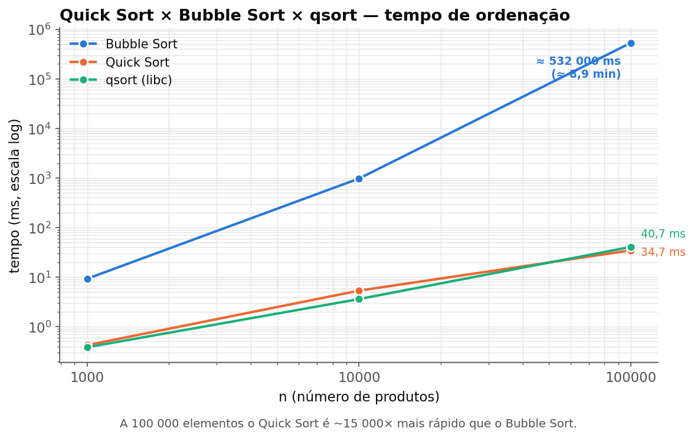
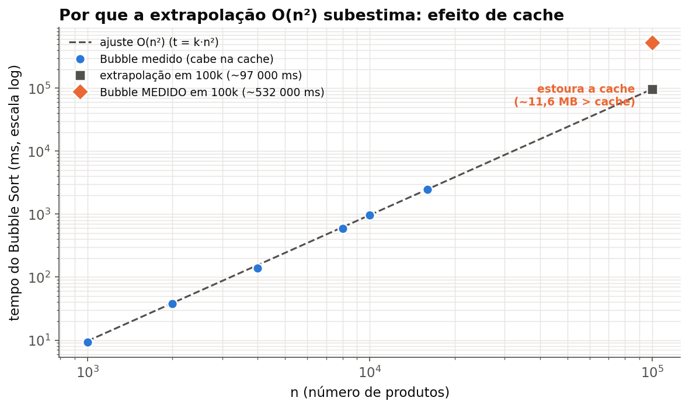

# G22_Ordenacao — Ranking de Produtos com Quick Sort

**Disciplina:** Estruturas de Dados 2 (EDA2) — 2026.2
**Professor:** Maurício Serrano
**Trabalho:** T2 — Ordenação
**Dupla:** Anna Clara Cardoso Evangelista Brandão (222006354) e Esdras de Sousa Nogueira (222006230)
**Repositório:** `github.com/eda2-2026/G22_Ordenacao_EDA2-2026.2`

---

## 1. Problema

Dado um catálogo de produtos em CSV, produzir um **ranking** ordenado por um
critério — **preço**, **avaliação**, **vendas** ou **nome** — em ordem
**crescente** ou **decrescente**.

## 2. Técnica — Quick Sort

Ordenação com **Quick Sort genérico**: a mesma função ordena por qualquer
critério, recebendo a comparação por ponteiro de função

```c
void quicksort(Produto *v, int n, int (*cmp)(const Produto*, const Produto*));
```

Detalhes a documentar ao longo do desenvolvimento: escolha do pivô (mediana de
três), esquema de partição e desempate por `id`.

## 3. Linguagem e build

C (padrão **C11**), compilando **sem warnings** com `gcc -Wall -Wextra -std=c11`.

## 4. Como executar

### Pré-requisitos

GCC e Make. No Windows, use o WSL ou o MinGW (no MinGW o comando costuma ser `mingw32-make`).

### Compilar

```bash
make            # gera o executável ./ranking
make clean      # apaga build/, ranking e gerador
```

### Ordenar o catálogo

```bash
./ranking <arquivo.csv> <criterio> <ordem> [quantidade]
```

| Argumento | Valores |
| --- | --- |
| `criterio` | `preco`, `avaliacao`, `vendas` ou `nome` |
| `ordem` | `asc` (crescente) ou `desc` (decrescente) |
| `quantidade` | quantos produtos exibir; padrão 10, `0` exibe todos |

Exemplos:

```bash
./ranking data/produtos.csv preco asc          # 10 mais baratos
./ranking data/produtos.csv avaliacao desc 5   # 5 mais bem avaliados
./ranking data/produtos.csv vendas desc 0      # todos, do mais vendido ao menos vendido
```

Rodar sem argumentos mostra a ajuda. Critério, ordem ou quantidade inválidos geram mensagem de erro.

### Gerar um catálogo grande

```bash
make gerador
./gerador 100000 data/grande.csv        # 100 mil produtos aleatórios
./gerador 100000 data/grande.csv 42     # com semente: gera sempre o mesmo catálogo
./ranking data/grande.csv preco asc 5
```

Arquivos `data/grande*.csv` ficam fora do Git (`.gitignore`).

### Rodar os testes

```bash
make test
```

Compila e executa todos os arquivos de `tests/`; para no primeiro que falhar.

### Formato do CSV

```
id,nome,preco,avaliacao,vendas
1,Fone Bluetooth JBL Tune 520,229.90,4.6,1840
2,Mouse sem fio Logitech M170,59.90,4.4,5320
```

- A primeira linha (cabeçalho) é ignorada; arquivos com quebra de linha do Windows (`\r\n`) são aceitos.
- Linhas com formato inválido, campos a mais, mais de 255 caracteres ou valores fora do intervalo
  (preço ou vendas negativos, avaliação fora de 0 a 5) são ignoradas com um aviso.
- O nome não pode conter vírgula e tem no máximo 99 caracteres.

## 5. Desempenho (Quick Sort × Bubble Sort × qsort)

Medições feitas com `tools/benchmark.c`, ordenando por **preço crescente**, com
produtos gerados aleatoriamente na memória. Cada valor é a **média de 3 execuções**
sobre catálogos diferentes. Antes de medir, o benchmark confere que os três
algoritmos produzem exatamente a mesma ordem final (mesmo critério, com desempate
por `id`).

| n | Bubble Sort | Quick Sort | qsort (libc) |
| --- | --- | --- | --- |
| 1.000 | 9,3 ms | 0,42 ms | 0,38 ms |
| 10.000 | 973 ms | 5,3 ms | 3,6 ms |
| 100.000 | ≈ 532.000 ms (≈ 8,9 min) † | 34,7 ms | 40,7 ms |



A 100.000 elementos o **Quick Sort é cerca de 15.000× mais rápido** que o Bubble
Sort (≈ 35 ms contra ≈ 8,9 minutos). É o retrato da diferença entre **O(n log n)**
e **O(n²)**: ao multiplicar `n` por 10, o Quick Sort cresce pouco mais que
proporcionalmente, enquanto o Bubble Sort cresce ~100× (de 1k para 10k) e, de 10k
para 100k, ainda mais. O nosso Quick Sort (pivô mediana-de-três) fica lado a lado
com o `qsort` da biblioteca padrão, o que indica que a implementação está num
patamar competitivo.

### Efeito de cache: por que medir Bubble Sort a 100k precisa de cuidado

Medir o Bubble Sort diretamente em 100.000 elementos leva **minutos de CPU a 100%**
(numa execução direta deu ≈ 532.000 ms em uma das nossas máquinas). Nos tamanhos pequenos (até
16k), porém, cada ordenação dura no máximo ~1s e segue um **O(n²) limpo**: ajustando
`t = k·n²` aos pontos medidos obtém-se `k ≈ 9,7×10⁻⁶ ms`.

O detalhe interessante é que essa extrapolação **subestima** o tempo real em 100k:
ela prevê ≈ 97.000 ms, mas a medição direta deu ≈ 532.000 ms — **~5,5× mais**. O
motivo é a **hierarquia de memória**: até 16k o vetor de produtos (≈ 1,8 MB) cabe
na cache do processador; a 100k ele tem ≈ 11,6 MB, estoura a cache e cada acesso
passa a buscar dados na RAM. O Bubble Sort, que varre o vetor repetidamente, é
penalizado fortemente — por isso o tempo real descola da curva O(n²) teórica.



*† valor medido diretamente. A extrapolação O(n²) a partir dos tamanhos que cabem
na cache preveria ≈ 97.000 ms; a diferença vem do efeito de cache descrito acima.*

## 6. Divisão de trabalho

- **Anna Clara :** quicksort, comparadores, bubble sort, benchmark, testes.
- **Esdras :** produto, leitura de CSV, gerador, interface (main), Makefile.
